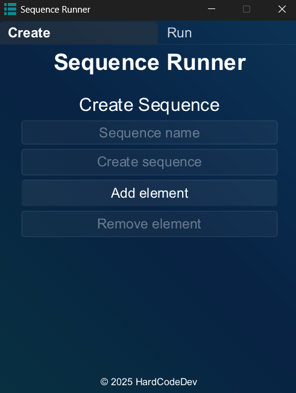
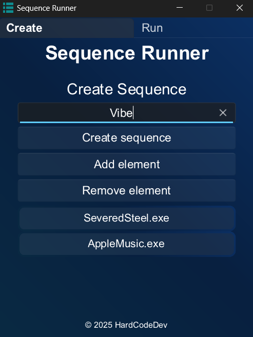

# Sequence Runner

---

## 🚀 Overview

**Sequence Runner** is an very easy-to-use and elegant app for making sequences of `*.exe`, managing and running them. Build with **C++** and **Slint**.

---

### Why should I use it? 

Imagine you enjoy playing Severed Steel with music while recording your gameplay. Basicly you'd **open Steam**, **start Severed Steel**, then **start OBS Studio**, then **open AppleMusic**. And what if you play like that every day? 

And now imagine that you can launch all of these with just **one click**. Sound cool, right?

---

## 📦 Installation

1. Download from the lates Release `Sequence_Runner.zip`
2. Unzip it and run `Sequence_Runner.exe`

---

## 🤔 How to use it?

---

### ✅ Add new sequence

1. Select **Create** tab(by default it's already selected).
2. Press **Add element** to add `.exe` to your sequence. You can add as many as you want. Press **Remove element** to remove last element.
3. In **Sequence name** write name for your sequence.

After all these actions, **Create** tab will look smth like that:

> `SeveredSteel.exe` and `AppleMusic.exe` are elements of sequence "Vibe".

4. Press **Create sequence**.

> [!NOTE]
> It will create `sequences.json`, where will be stored all your sequences. If you will delete all sequences - `sequences.json` will be deleted. It's normal behaviour.

---

### 👟 Run sequence

1. Select **Run** tab.
2. Press **Start sequence**.

> If you forgot which elements you added in selected sequence, press **Show sequence files**. If you want to remove sequence, press **Remove sequence**.

> [!IMPORTANT]
> Currently you can't remove element from created sequence. You need to create a new one.

---

## 📄 License

This project is licensed under the **MIT License**.  
See [LICENSE](LICENSE) for full terms.
